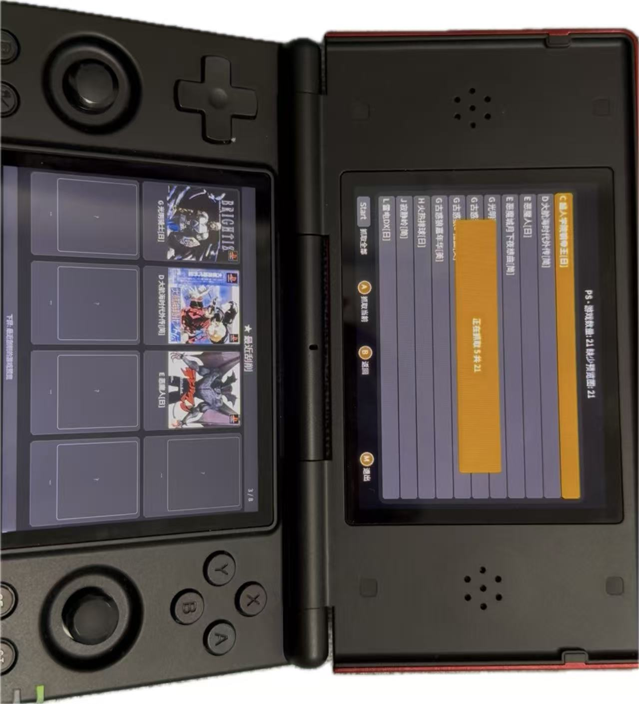

# Tiny Scraper

[English](./readme.md)

> 本项目是从 [Julioevm/tiny-scraper](https://github.com/Julioevm/tiny-scraper) 拉取的分支

---

## 新增功能

- **双屏支持**：新增下屏显示最近刮削的游戏预览，针对 RGDS 等双屏设备优化
- **刮削历史展示**：下屏展示最近刮削的游戏预览图，方便快速查看刮削结果
- **多语言支持**：现已支持 10 种语言，包括英文、简/繁体中文、日文、韩文、西班牙文、俄文、德文、法文、葡萄牙文（巴西），自动检测设备系统语言
- **界面重构**：全新设计的用户界面，支持多种屏幕分辨率（RG28xx、RG34xx、RGcubeXX）
- **RGDS Linux 支持**：新增对 RGDS 系列官方 Linux 固件的支持
- **Libretro 数据源支持**：新增 Libretro Thumbnails 作为数据源
- **多数据源自动回退**：支持配置多个数据源，优先使用 Libretro，失败后自动回退到 Screenscraper
- **多线程刮削**：Libretro 数据源支持多线程并行刮削（最多3线程），大幅提升刮削速度
- **游戏名称智能匹配**：通过 merged_games.json 实现中文游戏名称到英文名称的智能映射
- **详细刮削日志**：每次刮削时打印详细日志，包括数据源、耗时、成功/失败状态
- **启动日志清空**：程序启动时自动清空日志文件，避免累积旧日志
- **网络重试机制**：遇到临时网络错误（DNS失败、超时等）时自动重试，最多3次

---



---

## 平台


## 功能特性

- **简单易用**：直接在设备上下载封面媒体
- **友好界面**：专为掌上游戏设备设计的简洁界面
- **广泛兼容**：支持多种 ROM 文件类型和多种设备型号

## 支持设备

**Anbernic：**
- 已测试：**RG35XX H**
- 理论支持：RG40XXV、RGcubeXX、RG28xx、RG34xx
- 可能兼容：任何 Python >= 3.7 的 Anbernic 掌机

**RGDS（Linux）：**
- 支持官方 Linux 固件
- 已在多款 RGDS 掌机上测试

## 安装

1. **下载最新版本**：
   - 前往 [Releases](https://github.com/wang1025475397/tiny-scraper-by-libretro/releases) 下载最新版本

2. **传输到设备**：
   - 解压并将内容复制到设备的 `APPS` 目录
   - Anbernic SD2: `/mnt/sdcard/Roms/APPS`
   - Anbernic SD1: `/mnt/mmc/Roms/APPS`
   - RGDS: `/roms/apps/`

3. **配置 config.json**：
   在 `tiny_scraper` 文件夹中创建 `config.json` 文件：

```json
{
    "user": "your_user",
    "password": "your_password",
    "media_type": "sstitle",
    "region": "wor",
    "resize": false,
    "preferred_sources": ["libretro", "screenscraper"]
}
```

**配置说明：**

| 参数 | 说明 |
|------|------|
| `user` / `password` | 在 [screenscraper.fr](https://www.screenscraper.fr) 注册的账号 |
| `media_type` | 媒体类型：`ss`（截图）、`sstitle`（标题画面）、`box-2D`/`box-3D`（封面盒图）、`mixrbv1`/`mixrbv2`（混合图片） |
| `region` | 地区优先级：`wor`、`jp`、`eu`、`asi`、`kr`、`ss`、`us` |
| `resize` | `true`/`false` - 是否缩放到 320x240 |
| `preferred_sources` | 数据源优先级：`libretro`（本地缓存）、`screenscraper`（在线查询） |

4. **启动程序**：
   - Anbernic：从主菜单进入应用中心，选择 Apps，启动 Tiny Scraper
   - RGDS：从游戏菜单的 Apps 栏目启动

## 数据源说明

本程序支持两个数据源：

### Libretro Thumbnails

- **优点**：速度快（多线程）、无需网络、质量稳定
- **缺点**：需要提前下载缩略图库，可能缺少部分游戏

### Screenscraper

- **优点**：资源丰富，涵盖几乎所有游戏
- **缺点**：速度较慢（单线程），需要账号，需要网络

## 故障排除

旧版系统可能有问题。V 1.0.3 (20240511) 缺少 PIL 库：No module named 'PIL'，请尝试更新系统。

所有问题都会记录在 `tiny_scraper/log.txt` 文件中。

---

## 原始项目

[Julioevm/tiny-scraper](https://github.com/Julioevm/tiny-scraper)
